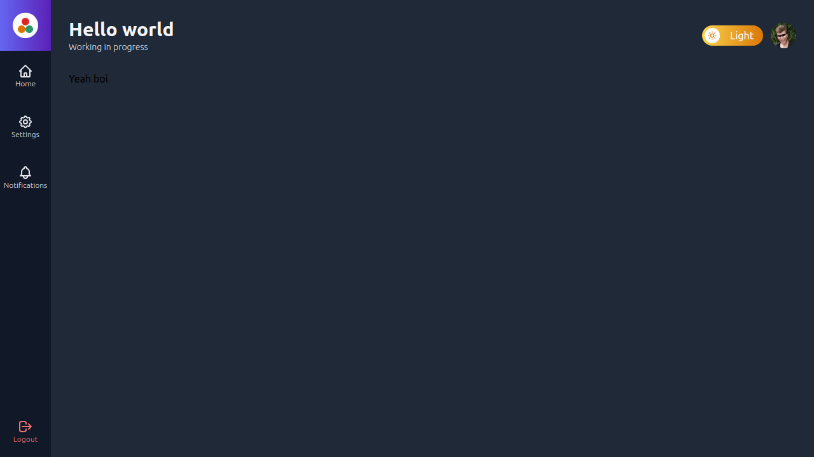

# Admin Template

## Getting Started

First, populate your `.env.local` based on `.env.example` with firebase keys
### Running the server

```bash
npm run dev
# or
yarn dev
```

***

### Login with google or email and password


### Dashboard to logged users



Open [http://localhost:3000](http://localhost:3000) with your browser to see the result.